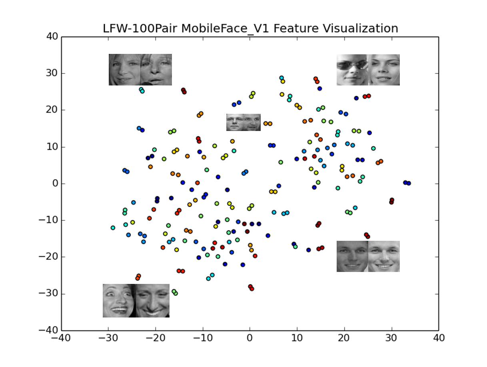

# MobileFace
A face recognition solution on mobile device.

## Performance
| Model | Framework | Size | CPU | Target |
| :---: |  :---: | :---: | :---: | :---: |
| MobileFace_Identification_V1 | MXNet | 3.40M | 35ms | Actual Scene |

## Example
To get fast face feature embedding with MXNet as follow:
```shell
cd example
python get_face_feature_mxnet.py
```

## Visualization
### t-SNE
I used the t-SNE algorithm to visualize in two dimensions the 256-dimensional embedding space. Every color corresponds to a different person(but colors are reused): as you can see, the MobileFace has learned to group those pictures quite tightly. (the distances between clusters are meaningless when using the t-SNE algorithm)  
  
To get the t-SNE feature visualization above as follow:
```shell
cd tool/tSNE
python face2feature.py # get features and lables and save them to txt
python tSNE_feature_visualization.py # load the txt to visualize face feature in 2D with tSNE
```
### ConfusionMatrix
I used the ConfusionMatrix to visualize the 256-dimensional feature similarity heatmap of the LFW-Aligned-100Pair: as you can see, the MobileFace has learned to get higher similarity when calculating the same person's different two face photos. Although the performance of the V1 version is not particularly stunning on LFW Dataset, it does not mean that it does not apply to the actual scene.  
  
To get the ConfusionMatrix feature similarity heatmap visualization above as follow:
```shell
cd tool/ConfusionMatrix
python ConfusionMatrix_similarity_visualization.py
```
## Tool
### MXNet2Caffe

## TODO
- [x] MobileFace_Identification
- [ ] MobileFace_Detection
- [ ] MobileFace_Landmark
- [ ] MobileFace_Align
- [ ] MobileFace_Attribute
- [ ] MobileFace_Pose
- [ ] MobileFace_NCNN
- [ ] MobileFace_FeatherCNN
- [ ] Benchmark_LFW

## Others
Coming Soon!

## Reference
[**t-SNE**](http://lvdmaaten.github.io/tsne/ "t-SNE")

