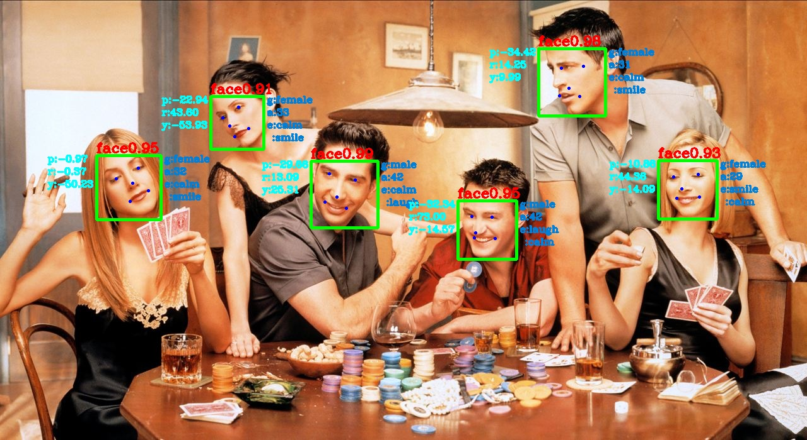
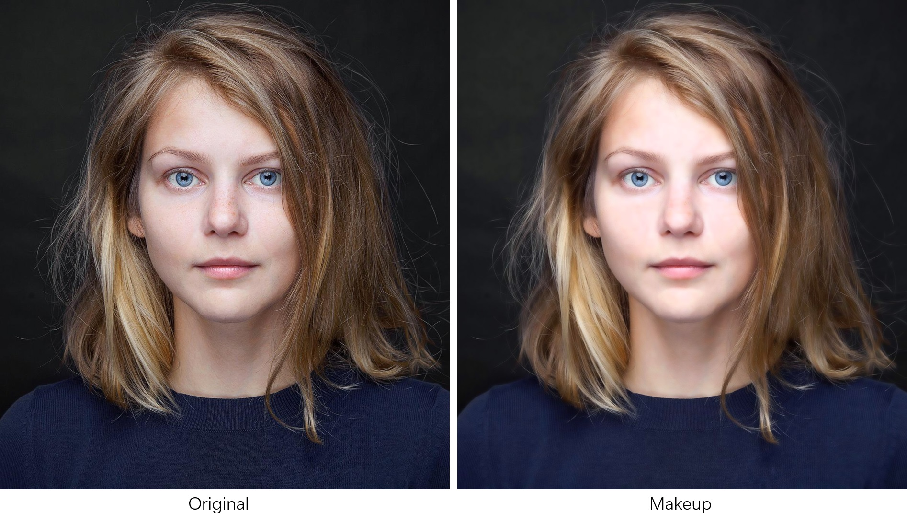

 

<div align="center"></div>

# MobileFace
A face recognition solution on mobile device.

## Prerequirements
- Anaconda (optional but recommend)
- MXNet and GluonCV ([the easiest way to install](https://gluon-cv.mxnet.io/index.html#installation "Install MXNet and GluonCV"))
- DLib (may be deprecated in the future)  
The easiest way to install DLib is through pip.
```shell
pip install dlib
```

## Performance
### Identification
| Model | Framework | Size | CPU | LFW | Target |
| :---: |  :---: | :---: | :---: | :---: | :---: |
| MobileFace_Identification_V1 | MXNet | 3.40M | 8.5ms | - | Actual Scene |
| MobileFace_Identification_V2 | MXNet | 3.41M | 9ms | 99.653% | Benchmark |
| :star2:MobileFace_Identification_V3 | MXNet | 2.10M | :boom:3ms(sota) | 95.466%(baseline) | Benchmark |

### Detection
| Model | Framework | Size | CPU |
| :---: |  :---: | :---: | :---: |
| MobileFace_Detection_V1 | MXNet/GluonCV | 30M | 20ms/50fps |

### Landmark
| Model | Framework | Size | CPU |
| :---: |  :---: | :---: | :---: |
| MobileFace_Landmark_V1 | DLib | 5.7M | <1ms |

### Pose
| Model | Framework | Size | CPU |
| :---: |  :---: | :---: | :---: |
| MobileFace_Pose_V1 | free | <1K | <0.1ms |

### Align
| Model | Framework | Size | CPU |
| :---: |  :---: | :---: | :---: |
| MobileFace_Align_V1 | free | <1K | <0.1ms |

### Attribute
| Model | Framework | Size | CPU |
| :---: |  :---: | :---: | :---: |
| MobileFace_Attribute_V1 | MXNet/GluonCV | 16.4M | 14ms/71fps |

### Tracking
| Model | Framework | Size | CPU |
| :---: |  :---: | :---: | :---: |
| MobileFace_Tracking_V1 | free | - | <2ms |

## Example
To get fast face feature embedding with MXNet as follow:
```shell
cd example
python get_face_feature_v1_mxnet.py # v1, v2, v3
```

To get fast face detection result with MXNet/GluonCV as follow:
```shell
cd example
python get_face_boxes_gluoncv.py
```

To get fast face landmarks result with dlib as follow:
```shell
cd example
python get_face_landmark_dlib.py
```

To get fast face pose result as follow:
```shell
cd example
python get_face_pose.py
```

To get fast face align result as follow:
```shell
cd example
python get_face_align.py
```

To get fast face attribute results as follow:
```shell
cd example
python get_face_attribute_gluoncv.py
```

To get mobileface all results as follow:
```shell
cd example
python mobileface_allinone.py
```

To get mobileface fast tracking result as follow:
```shell
cd example
python get_face_tracking_v1.py
```
<div align="center"></div>  


To get mobileface makeup result as follow:
```shell
cd example
python get_face_makeup_v1.py
```
 

To get mobileface enhancement result as follow:
```shell
cd example
python get_face_enhancement_v1.py
```
 

## Visualization
### t-SNE
I used the t-SNE algorithm to visualize in two dimensions the 256-dimensional embedding space. Every color corresponds to a different person(but colors are reused): as you can see, the MobileFace has learned to group those pictures quite tightly. (the distances between clusters are meaningless when using the t-SNE algorithm)  
  
To get the t-SNE feature visualization above as follow:
```shell
cd tool/tSNE
python face2feature.py # get features and lables and save them to txt
python tSNE_feature_visualization.py # load the txt to visualize face feature in 2D with tSNE
```
### ConfusionMatrix
I used the ConfusionMatrix to visualize the 256-dimensional feature similarity heatmap of the LFW-Aligned-100Pair: as you can see, the MobileFace has learned to get higher similarity when calculating the same person's different two face photos. Although the performance of the V1 version is not particularly stunning on LFW Dataset, it does not mean that it does not apply to the actual scene.  
  
To get the ConfusionMatrix feature similarity heatmap visualization above as follow:
```shell
cd tool/ConfusionMatrix
python ConfusionMatrix_similarity_visualization.py
```
## Tool
### Time
To get inference time of different version's MXNet models as follow:
```shell
cd tool/time
python inference_time_evaluation_mxnet.py --symbol_version=V3 # default = V1
```
### Model_Prune
Prune the MXNet model through deleting the needless layers (such as classify layer and loss layer) and only retaining features layers to decrease the model size for inference as follow:
```shell
cd tool/prune
python model_prune_mxnet.py
```
### MXNet2Caffe
### Merge_bn

## Benchmark
### LFW
The LFW test dataset (aligned by [MTCNN](https://kpzhang93.github.io/MTCNN_face_detection_alignment/index.html) and cropped to 112x112) can be download from [Dropbox](https://www.dropbox.com/s/wpx6tqjf0y5mf6r/faces_ms1m-refine-v2_112x112.zip?dl=0) or [BaiduDrive](https://pan.baidu.com/s/1S6LJZGdqcZRle1vlcMzHOQ), and then put it (named lfw.bin) in the directory of ```data/LFW-bin```.  
To get the LFW comparison result and plot the ROC curves as follow:
```shell
cd benchmark/LFW
python lfw_comparison_and_plot_roc.py
```
 
### MegaFace

## TODO
- [x] MobileFace_Identification
- [x] MobileFace_Detection
- [x] MobileFace_Landmark
- [x] MobileFace_Align
- [x] MobileFace_Attribute
- [x] MobileFace_Pose
- [x] MobileFace_Tracking
- [x] MobileFace_Makeup
- [x] MobileFace_Enhancement
- [ ] MobileFace_Swap
- [ ] MobileFace_NCNN
- [ ] MobileFace_FeatherCNN
- [x] Benchmark_LFW
- [ ] Benchmark_MegaFace

## Others
Coming Soon!

## Reference
- [**t-SNE**](http://lvdmaaten.github.io/tsne/ "t-SNE")
- [**InsightFace**](https://github.com/deepinsight/insightface "InsightFace")
- [**SORT**](https://github.com/abewley/sort "sort")